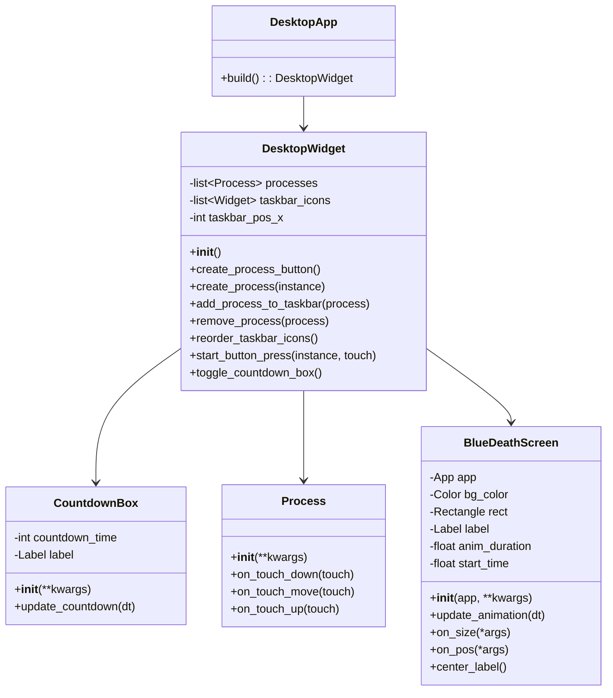
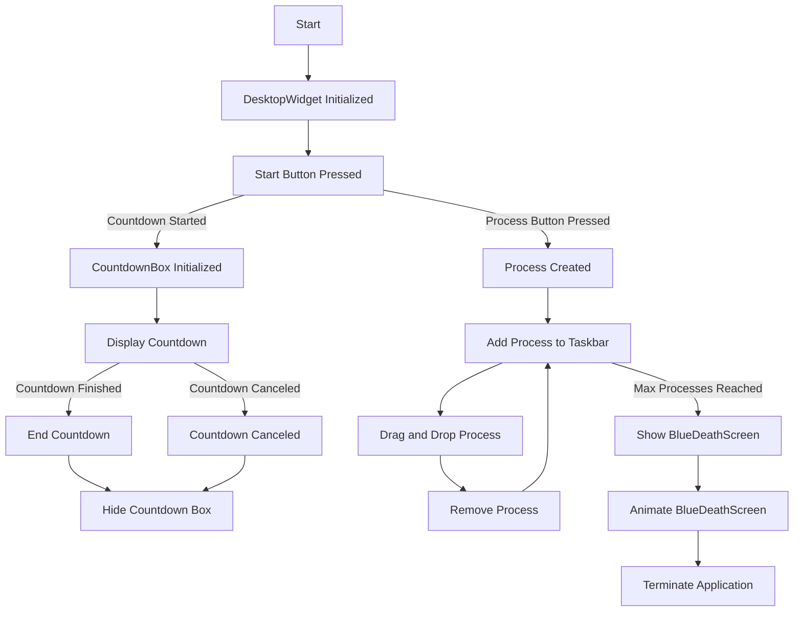

# Informe: Creación de un Simulador Virtual en Python con Kivy

## Introducción

En este informe se describe el proceso de creación de un simulador virtual desarrollado en Python utilizando la biblioteca Kivy. El objetivo principal del simulador es recrear un sistema experto, proporcionando una interfaz interactiva para simular y experimentar con los procesos del sistema experto.

## Objetivo del Proyecto

El propósito de este proyecto es desarrollar un simulador que permita a los usuarios interactuar con un sistema experto en un entorno virtual. El simulador está diseñado para facilitar la comprensión de cómo funciona el sistema experto al proporcionar una interfaz gráfica intuitiva y dinámica.

## Tecnologías Utilizadas

- *Lenguaje de Programación:* Python
- *Biblioteca para Interfaz Gráfica:* Kivy
- **Entorno de Desarrollo: Visual Studio Code
- **Sistema Operativo: Windows y Linux

## Pasos del Proceso de Creación

### 1. Definición de Requisitos

Se definieron los requisitos funcionales y no funcionales del simulador, incluyendo las características que debía tener la interfaz gráfica y la funcionalidad del sistema experto.

### 2. Diseño de la Interfaz

Se diseñó la interfaz gráfica del simulador utilizando Kivy, que es una biblioteca de Python para crear aplicaciones multitáctiles y interfaces gráficas. Se crearon los siguientes elementos:
- Ventanas y pantallas
- Botones e iconos
- Campos de entrada y salida de datos
- Disposición y estilo de los elementos

### 3. Implementación del Sistema Experto

Se implementó la lógica del sistema experto en Python. Esta lógica incluye:
- *Base de Conocimiento:* Definición de reglas y hechos.
- *Motor de Inferencia:* Algoritmo para aplicar las reglas y llegar a conclusiones.
- *Interfaz de Usuario:* Conexión entre la lógica del sistema experto y los elementos gráficos creados en Kivy.

### 4. Integración de la Interfaz y la Lógica

Se integraron los componentes gráficos con la lógica del sistema experto. Esto implicó conectar eventos de la interfaz (como clics de botones) con funciones y métodos que ejecutan la lógica del sistema experto.

### 5. Pruebas y Validación

Se llevaron a cabo pruebas para asegurar que el simulador funcionara correctamente. Las pruebas incluyeron:
- Verificación de la funcionalidad de la interfaz gráfica
- Pruebas de la lógica del sistema experto
- Validación del flujo de datos entre la interfaz y la lógica

## Conclusiones

El simulador virtual desarrollado proporciona una herramienta eficaz para interactuar con un sistema experto en un entorno virtual. La combinación de Python y Kivy ha demostrado ser adecuada para crear una interfaz gráfica interactiva y dinámica que facilita la comprensión del sistema experto.
## Referencias

- [Kivy Documentation] https://kivy.org/doc/stable/ 
- [Python Documentation] https://www.python.org/doc/

## PseudoCodigo

### Inicialización de la Aplicación
1. Definir la clase `DesktopApp` que hereda de `App`.
2. Definir el método `build`:
    - Crear una instancia de `DesktopWidget`.
    - Devolver la instancia de `DesktopWidget` para ser mostrada en la aplicación.

### Clase DesktopWidget
3. Definir la clase `DesktopWidget` que hereda de `Widget`.

#### Inicialización de DesktopWidget
4. Definir el método `__init__`:
    - Llamar al constructor de la clase `Widget` con `super()`.
    - Inicializar atributos para el proceso y los iconos de la barra de tareas.
    - Dibujar el fondo azul:
        - Crear un color azul usando `Color(0, 0, 1, 1)`.
        - Dibujar un rectángulo que cubre todo el widget usando `Rectangle(size=Window.size, pos=self.pos)`.
    - Crear la barra de tareas:
        - Crear un widget para la barra de tareas con tamaño 800x40 y posición (0, 0).
        - Dibujar un rectángulo gris para la barra de tareas.
        - Añadir la barra de tareas al widget principal.
    - Crear el botón de inicio:
        - Crear un widget para el botón de inicio con tamaño 40x40 y posición (0, 0).
        - Dibujar un círculo verde para el botón de inicio.
        - Añadir el botón de inicio a la barra de tareas.
        - Asociar eventos de toque para cambiar el color y mostrar el cuadro de cuenta regresiva.

#### Métodos de DesktopWidget
5. Definir el método `create_process_button`:
    - Crear un botón de aplicación con tamaño 100x100 y posición centrada.
    - Dibujar un rectángulo rojo para el botón.
    - Asociar el evento de toque para crear un proceso.
    - Añadir el botón al widget principal.

6. Definir el método `create_process`:
    - Verificar si el número de procesos es menor o igual a 5:
        - Crear una instancia de `Process`.
        - Añadir la instancia de `Process` a la lista de procesos y al widget principal.
        - Añadir el proceso a la barra de tareas.
    - Si el número de procesos es mayor que 5:
        - Mostrar la pantalla azul de la muerte y terminar la aplicación.

7. Definir el método `add_process_to_taskbar`:
    - Crear un icono de proceso con tamaño 40x40.
    - Dibujar un rectángulo negro para el icono.
    - Asociar el evento de toque para eliminar el proceso.
    - Añadir el icono a la barra de tareas y a la lista de iconos.

8. Definir el método `remove_process`:
    - Eliminar el proceso de la lista de procesos y del widget principal.
    - Eliminar el icono correspondiente de la barra de tareas.
    - Reordenar los iconos restantes en la barra de tareas.

9. Definir el método `reorder_taskbar_icons`:
    - Inicializar la posición X para los iconos de la barra de tareas.
    - Reposicionar cada icono en la barra de tareas, ajustando su posición horizontal.

### Clase CountdownBox
10. Definir la clase `CountdownBox` que hereda de `Widget`.

#### Inicialización de CountdownBox
11. Definir el método `__init__`:
    - Llamar al constructor de la clase `Widget` con `super()`.
    - Inicializar el tiempo de cuenta regresiva a 5 segundos.
    - Crear un `Label` para mostrar la cuenta regresiva.
    - Dibujar un rectángulo gris para el cuadro de cuenta regresiva.
    - Programar la actualización de la cuenta regresiva a 1 segundo.

#### Método de CountdownBox
12. Definir el método `update_countdown`:
    - Reducir el tiempo de cuenta regresiva en 1.
    - Actualizar el texto del `Label` con el tiempo restante.
    - Si el tiempo llega a 0, detener la cuenta regresiva y cambiar el color del botón a verde.

### Clase Process
13. Definir la clase `Process` que hereda de `Widget`.

#### Inicialización de Process
14. Definir el método `__init__`:
    - Llamar al constructor de la clase `Widget` con `super()`.
    - Dibujar un rectángulo azul para representar el proceso.
    - Asociar eventos de toque para iniciar el arrastre y soltar el proceso.

#### Métodos de Process
15. Definir el método `on_touch_down`:
    - Iniciar el arrastre del proceso.

16. Definir el método `on_touch_move`:
    - Mover el proceso mientras se arrastra.

17. Definir el método `on_touch_up`:
    - Finalizar el arrastre del proceso.

### Clase BlueDeathScreen
18. Definir la clase `BlueDeathScreen` que hereda de `Widget`.

#### Inicialización de BlueDeathScreen
19. Definir el método `__init__`:
    - Llamar al constructor de la clase `Widget` con `super()`.
    - Dibujar el fondo azul.
    - Crear un `Label` con el texto "DEAD" y añadirlo al widget.
    - Programar la animación del fondo y el texto.
    - Guardar el tiempo de inicio de la animación.

#### Métodos de BlueDeathScreen
20. Definir el método `update_animation`:
    - Calcular el tiempo transcurrido desde el inicio de la animación.
    - Alternar el color del fondo entre azul y blanco cada 0.5 segundos.
    - Alternar el color del texto entre blanco y negro cada 0.5 segundos.
    - Si el tiempo de animación ha terminado, detener la animación y terminar la aplicación.

21. Definir el método `on_size`:
    - Actualizar la posición y tamaño del fondo.
    - Centrar el texto.

22. Definir el método `on_pos`:
    - Actualizar la posición del fondo.

23. Definir el método `center_label`:
    - Centrar el texto en el widget.

## Diagrama de Clases

## Diagrama de Flujo
